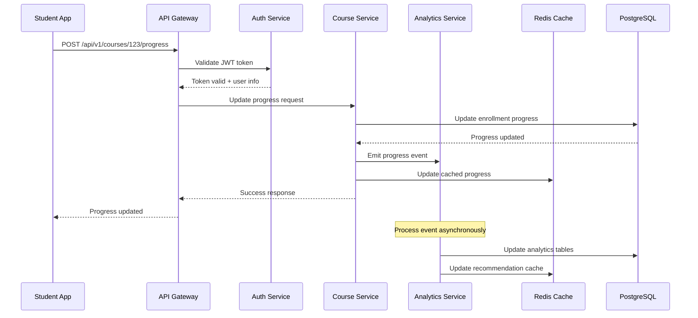

# 🏗️ Technical Architecture Overview

## System Architecture: Modern Educational Platform

### Current State → Future State Transformation

```
STATIC ARCHITECTURE                 DYNAMIC WEB APPLICATION
┌─────────────────────┐            ┌─────────────────────────────────┐
│   Static Files      │            │        Frontend Layer          │
│   ├── HTML/CSS/JS   │     →      │   ├── React/Next.js App        │
│   ├── Local Storage │            │   ├── TypeScript/Tailwind      │
│   └── GitHub Pages  │            │   └── PWA Capabilities         │
└─────────────────────┘            └─────────────────────────────────┘
                                                    │
                                   ┌─────────────────────────────────┐
                                   │         API Gateway            │
                                   │   ├── GraphQL/REST APIs        │
                                   │   ├── Authentication           │
                                   │   └── Rate Limiting            │
                                   └─────────────────────────────────┘
                                                    │
                    ┌──────────────────────────────────────────────────────┐
                    │                 Microservices Layer                  │
                    │ ┌─────────────┬─────────────┬──────────────────────┐ │
                    │ │User Service │Course Service│Analytics Service    │ │
                    │ │Auth Service │Content Mgmt │Notification Service │ │
                    │ │Search Service│AI/ML Service│File Storage Service│ │
                    │ └─────────────┴─────────────┴──────────────────────┘ │
                    └──────────────────────────────────────────────────────┘
                                                    │
                    ┌──────────────────────────────────────────────────────┐
                    │                   Data Layer                         │
                    │ ┌─────────────┬─────────────┬──────────────────────┐ │
                    │ │PostgreSQL   │MongoDB      │Redis Cache           │ │
                    │ │Elasticsearch│InfluxDB    │MinIO/S3 Storage      │ │
                    │ └─────────────┴─────────────┴──────────────────────┘ │
                    └──────────────────────────────────────────────────────┘
```

## 🔧 Architecture Principles

### 1. **Microservices Architecture**
- **Service Independence**: Each service can be developed, deployed, and scaled independently
- **Technology Diversity**: Use the best tool for each job
- **Fault Isolation**: Failure in one service doesn't bring down the entire system
- **Team Autonomy**: Different teams can own different services

### 2. **Cloud-Native Design**
- **Containerization**: Docker containers for consistent deployment
- **Orchestration**: Kubernetes for container management
- **Auto-scaling**: Automatic scaling based on demand
- **Service Mesh**: Istio for service-to-service communication

### 3. **Event-Driven Architecture**
- **Asynchronous Communication**: Services communicate via events
- **Real-time Updates**: WebSocket connections for live features
- **Event Sourcing**: Complete audit trail of all changes
- **CQRS Pattern**: Separate read and write operations

### 4. **Security-First Design**
- **Zero Trust Architecture**: Verify everything, trust nothing
- **End-to-End Encryption**: Data encrypted in transit and at rest
- **RBAC**: Role-based access control throughout the system
- **API Security**: OAuth2, JWT tokens, rate limiting

## 🏢 System Components Deep Dive

### Frontend Architecture

#### **React/Next.js Application**
```typescript
// Modern Frontend Stack
const frontendArchitecture = {
  framework: "Next.js 14 (App Router)",
  language: "TypeScript 5.0+",
  styling: "Tailwind CSS + shadcn/ui",
  stateManagement: "Zustand + React Query",
  forms: "React Hook Form + Zod validation",
  routing: "Next.js App Router",
  testing: "Vitest + React Testing Library",
  e2etesting: "Playwright",
  bundling: "Webpack 5 (built into Next.js)",
  deployment: "Vercel Edge Functions"
};
```

#### **Component Architecture**
```
src/
├── app/                    # Next.js App Router
│   ├── (auth)/            # Authentication routes
│   ├── dashboard/         # Main dashboard
│   ├── courses/           # Course management
│   └── api/               # API routes
├── components/            # Reusable UI components
│   ├── ui/                # Base UI components
│   ├── forms/             # Form components
│   ├── charts/            # Data visualization
│   └── layouts/           # Page layouts
├── lib/                   # Utility functions
│   ├── api.ts             # API client
│   ├── auth.ts            # Authentication
│   ├── db.ts              # Database client
│   └── utils.ts           # Helper functions
├── hooks/                 # Custom React hooks
├── stores/                # Zustand stores
└── types/                 # TypeScript definitions
```

### Backend Architecture

#### **API Gateway (Node.js + Express)**
```javascript
// API Gateway Configuration
const apiGateway = {
  framework: "Express.js + Fastify",
  authentication: "Auth0/Supabase Auth",
  rateLimit: "Redis-based rate limiting",
  cors: "Configurable CORS policies",
  logging: "Winston + ELK Stack",
  monitoring: "Prometheus + Grafana",
  documentation: "OpenAPI 3.0 + Swagger UI"
};

// Route Structure
routes = {
  "/api/v1/auth/*": "Authentication Service",
  "/api/v1/users/*": "User Management Service", 
  "/api/v1/courses/*": "Course Management Service",
  "/api/v1/content/*": "Content Management Service",
  "/api/v1/analytics/*": "Analytics Service",
  "/api/v1/ml/*": "Machine Learning Service"
};
```

#### **Microservices Design**

```yaml
# Service Architecture
services:
  user-service:
    language: "Node.js + TypeScript"
    database: "PostgreSQL"
    cache: "Redis"
    responsibilities:
      - User registration/authentication
      - Profile management
      - Preference settings
      - Social features

  course-service:
    language: "Python + FastAPI"
    database: "MongoDB + PostgreSQL"
    cache: "Redis"
    responsibilities:
      - Course creation/management
      - Curriculum structuring
      - Progress tracking
      - Assessment management

  content-service:
    language: "Node.js + Express"
    database: "MongoDB"
    storage: "MinIO/S3"
    responsibilities:
      - File upload/management
      - Video streaming
      - Document processing
      - CDN integration

  analytics-service:
    language: "Python + FastAPI"
    database: "InfluxDB + PostgreSQL"
    ml_framework: "scikit-learn + TensorFlow"
    responsibilities:
      - Learning analytics
      - Predictive modeling
      - Performance metrics
      - Reporting dashboards

  ai-service:
    language: "Python + FastAPI"
    ml_frameworks: "TensorFlow + PyTorch + Transformers"
    vector_db: "Pinecone/Weaviate"
    responsibilities:
      - Personalized recommendations
      - AI tutoring chatbot
      - Content generation
      - Automated assessment
```

### Database Architecture

#### **Multi-Database Strategy**
```sql
-- PostgreSQL (Primary Database)
-- User data, course structure, assessments
CREATE TABLE users (
    id UUID PRIMARY KEY DEFAULT gen_random_uuid(),
    email VARCHAR(255) UNIQUE NOT NULL,
    name VARCHAR(255) NOT NULL,
    role user_role NOT NULL,
    created_at TIMESTAMP WITH TIME ZONE DEFAULT NOW(),
    updated_at TIMESTAMP WITH TIME ZONE DEFAULT NOW()
);

CREATE TABLE courses (
    id UUID PRIMARY KEY DEFAULT gen_random_uuid(),
    title VARCHAR(255) NOT NULL,
    description TEXT,
    instructor_id UUID REFERENCES users(id),
    status course_status DEFAULT 'draft',
    metadata JSONB,
    created_at TIMESTAMP WITH TIME ZONE DEFAULT NOW()
);

CREATE TABLE enrollments (
    id UUID PRIMARY KEY DEFAULT gen_random_uuid(),
    user_id UUID REFERENCES users(id),
    course_id UUID REFERENCES courses(id),
    progress DECIMAL(5,2) DEFAULT 0.00,
    enrolled_at TIMESTAMP WITH TIME ZONE DEFAULT NOW(),
    completed_at TIMESTAMP WITH TIME ZONE,
    UNIQUE(user_id, course_id)
);
```

```javascript
// MongoDB (Content & Dynamic Data)
// Flexible content structure, user activities, logs
const contentSchema = {
  _id: ObjectId,
  courseId: String,
  moduleId: String,
  type: "video|document|quiz|assignment",
  title: String,
  content: {
    // Flexible content structure
    text: String,
    videoUrl: String,
    attachments: [String],
    questions: [Object]
  },
  metadata: {
    difficulty: Number,
    estimatedTime: Number,
    prerequisites: [String],
    learningObjectives: [String]
  },
  createdAt: Date,
  updatedAt: Date
};

const userActivitySchema = {
  _id: ObjectId,
  userId: String,
  courseId: String,
  sessionId: String,
  activities: [{
    type: "view|click|submit|complete",
    timestamp: Date,
    data: Object
  }],
  createdAt: Date
};
```

```javascript
// Redis (Caching & Sessions)
const redisStructure = {
  // Session management
  "session:${sessionId}": {
    userId: "uuid",
    expiresAt: "timestamp",
    data: "encrypted_session_data"
  },
  
  // Real-time data caching
  "user:${userId}:progress": {
    courseId: "progress_percentage",
    lastAccessed: "timestamp",
    currentModule: "module_id"
  },
  
  // Rate limiting
  "rateLimit:${userId}:${endpoint}": {
    count: "number",
    resetTime: "timestamp"
  }
};
```

## 🔄 Data Flow Architecture

### **Request Flow Example: Course Progress Update**



### **Real-time Feature Architecture**

```typescript
// WebSocket Connection Management
interface WebSocketManager {
  // Connection handling
  onConnect(socket: WebSocket, userId: string): void;
  onDisconnect(socket: WebSocket): void;
  
  // Room management
  joinRoom(socket: WebSocket, roomId: string): void;
  leaveRoom(socket: WebSocket, roomId: string): void;
  
  // Message broadcasting
  broadcastToRoom(roomId: string, message: any): void;
  sendToUser(userId: string, message: any): void;
}

// Event-driven updates
const eventTypes = {
  PROGRESS_UPDATE: "course.progress.updated",
  NEW_MESSAGE: "chat.message.new",
  ASSIGNMENT_SUBMITTED: "assignment.submitted",
  PEER_JOINED: "collaboration.peer.joined",
  SYSTEM_NOTIFICATION: "system.notification"
};
```

## 📱 Mobile Architecture

### **React Native Application**
```typescript
// Mobile App Architecture
const mobileArchitecture = {
  framework: "React Native + Expo",
  stateManagement: "Redux Toolkit",
  navigation: "React Navigation 6",
  networking: "Apollo GraphQL Client",
  storage: "AsyncStorage + SQLite",
  authentication: "Auth0 SDK",
  push notifications: "Expo Notifications",
  offline_support: "Redux Persist + NetInfo"
};

// Shared code structure
mobile/
├── src/
│   ├── components/        # Reusable UI components
│   ├── screens/           # Screen components
│   ├── navigation/        # Navigation configuration
│   ├── services/          # API and external services
│   ├── store/             # Redux store configuration
│   ├── utils/             # Utility functions
│   └── types/             # TypeScript definitions
├── assets/                # Images, fonts, etc.
└── __tests__/            # Test files
```

## 🔍 Search Architecture

### **Elasticsearch Implementation**
```json
{
  "mappings": {
    "properties": {
      "title": {
        "type": "text",
        "analyzer": "standard",
        "fields": {
          "keyword": {"type": "keyword"}
        }
      },
      "content": {
        "type": "text",
        "analyzer": "standard"
      },
      "course_id": {"type": "keyword"},
      "module_id": {"type": "keyword"},
      "difficulty": {"type": "integer"},
      "tags": {"type": "keyword"},
      "created_at": {"type": "date"}
    }
  },
  "settings": {
    "analysis": {
      "analyzer": {
        "custom_analyzer": {
          "tokenizer": "standard",
          "filter": ["lowercase", "stop", "stemmer"]
        }
      }
    }
  }
}
```

## 🚀 Deployment Architecture

### **Container Strategy**
```dockerfile
# Multi-stage build for Next.js frontend
FROM node:18-alpine AS frontend-builder
WORKDIR /app
COPY package*.json ./
RUN npm ci --only=production
COPY . .
RUN npm run build

FROM node:18-alpine AS frontend-runtime
WORKDIR /app
COPY --from=frontend-builder /app/.next ./.next
COPY --from=frontend-builder /app/public ./public
COPY --from=frontend-builder /app/package*.json ./
RUN npm ci --only=production
EXPOSE 3000
CMD ["npm", "start"]

# Python microservice
FROM python:3.11-slim AS python-service
WORKDIR /app
COPY requirements.txt .
RUN pip install --no-cache-dir -r requirements.txt
COPY . .
EXPOSE 8000
CMD ["uvicorn", "main:app", "--host", "0.0.0.0", "--port", "8000"]
```

### **Kubernetes Deployment**
```yaml
# Next.js Frontend Deployment
apiVersion: apps/v1
kind: Deployment
metadata:
  name: frontend-deployment
spec:
  replicas: 3
  selector:
    matchLabels:
      app: frontend
  template:
    metadata:
      labels:
        app: frontend
    spec:
      containers:
      - name: frontend
        image: your-registry/frontend:latest
        ports:
        - containerPort: 3000
        env:
        - name: DATABASE_URL
          valueFrom:
            secretKeyRef:
              name: db-secret
              key: url
        resources:
          requests:
            memory: "256Mi"
            cpu: "250m"
          limits:
            memory: "512Mi"
            cpu: "500m"
```

## 📊 Monitoring & Observability

### **Monitoring Stack**
```yaml
monitoring:
  metrics:
    - Prometheus (metrics collection)
    - Grafana (visualization)
    - AlertManager (alerting)
  
  logging:
    - Fluentd (log collection)
    - Elasticsearch (log storage)
    - Kibana (log visualization)
  
  tracing:
    - Jaeger (distributed tracing)
    - OpenTelemetry (instrumentation)
  
  uptime:
    - Pingdom (external monitoring)
    - StatusPage (status communication)
```

### **Performance Monitoring**
```typescript
// Performance metrics to track
interface PerformanceMetrics {
  // Frontend metrics
  firstContentfulPaint: number;
  largestContentfulPaint: number;
  cumulativeLayoutShift: number;
  firstInputDelay: number;
  
  // API metrics
  responseTime: number;
  throughput: number;
  errorRate: number;
  
  // Business metrics
  courseCompletionRate: number;
  userEngagementTime: number;
  conversionRate: number;
}
```

This technical architecture provides a solid foundation for scaling from the current static site to a world-class educational platform capable of serving millions of learners globally.